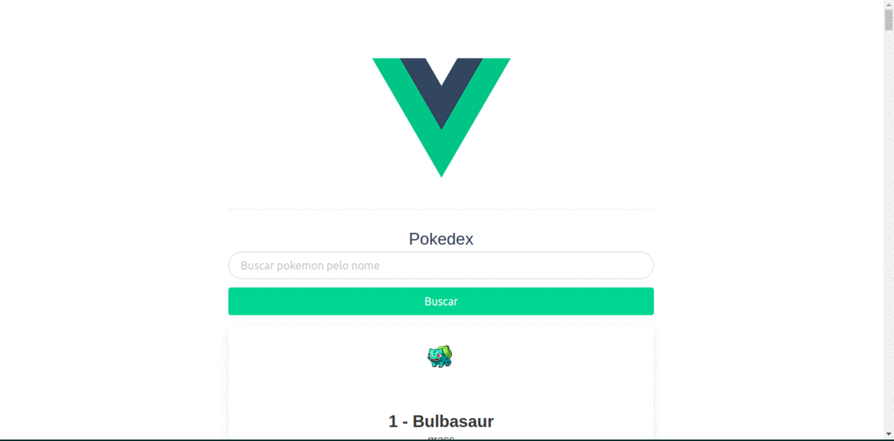

# :dragon_face: Pokedex v1.0

<p align="center">
  
  
  
  
  
</p>

Essa aplicação foi desenvolvida no curso de Vue no canal do youtube [Victor Lima](https://www.youtube.com/channel/UC_issB-37g9lwfAA37fy2Tg).
Ela consome API PokéAPI e exibe os pokemons na tela.

## :computer: Tecnologias

Este projeto foi desenvolvido com as seguintes tecnologias:

-  [PokéAPI](https://pokeapi.co/)
-  [Vue](https://vuejs.org/)
-  [VS Code](https://code.visualstudio.com/)

### :arrow_forward: Em Execução:

<p align="center">
 
</p>

### :information_source: Como usar:

Para clonar e executar esta aplicação, você precisará do Git instalado em seu computador. Na linha de comando:

```bash
# Clonar este repositório
$ git clone https://github.com/DiegoTeixeira7/pokedex.git

# Vá para o repositório
$ cd pokedex

# Instale as dependências
$ sudo apt-get update && apt-get upgrade
$ yarn install | npm install

# Execute o projeto

## Ambiente de desenvolvimento
$ yarn serve | npm run serve

## Ambiente de produção
$ yarn build | npm run build

```
### :memo: Licença
Este projeto está sob a licença do MIT. Consulte a [LICENSE](LICENSE) para obter mais informações.
